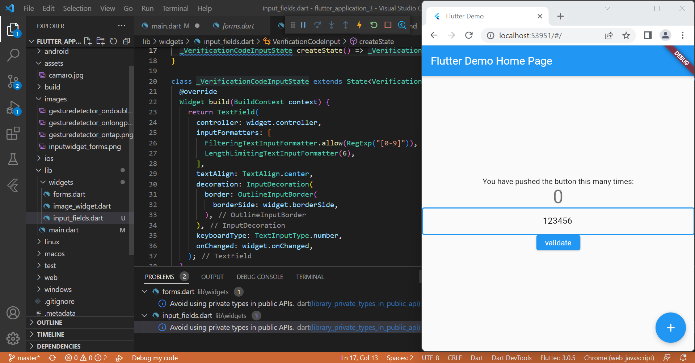

# Laporan Praktikum

## Gesture Detector

1. onTap

Gambar diatas adalah hasil *running project* flutter_application_3. Dapat dilihat, apabila gambar di klik sekali, maka angka yang ada dibawahnya akan bertambah. Ini disebabkan karena perintah **onTap: _incrementCounter** yang disematkan pada kode.

2. onDoubleTap

Gambar diatas adalah hasil *running project* flutter_application_3. Dapat dilihat, apabila gambar di klik dua kali, maka angka yang ada dibawahnya akan bertambah. Ini disebabkan karena perintah **onDoubleTap: _incrementCounter** yang disematkan pada kode.

3. onLongPress

Gambar diatas adalah hasil *running project* flutter_application_3. Dapat dilihat, apabila gambar di tekan lama, maka angka yang ada dibawahnya akan bertambah. Ini disebabkan karena perintah **onLongPress: _incrementCounter** yang disematkan pada kode.

## Input Widget dan Forms

Gambar diatas adalah hasil *running project* flutter_application_3 setelah ditambahkan _input widget_ dan _forms_. Pada kolom pertama, teks di atur secara _default_, yaitu "Sukses". Ketika tombol **validate** di tekan, maka akan muncul tulisan "Sukses" dibawah tulisan "Teks :". Kita juga dapat mengisi kolom kedua menggunakan input keyboard. 

## Custom Input dan FormField Widget

Gambar diatas adalah hasil *running project* flutter_application_3 setelah ditambahkan _custom input_ dan _formfield widget_. Data yang bisa dimasukkan kedalam _form_ hanya data angka, mulai dari 0 hingga 9 dengan jumlah digit maksimalnya yaitu 6 digit. Hal ini dikarenakan perintah **FilteringTextInputFormatter.allow(RegExp("[0-9]")** menentukan *range input* angka dari 0 sampai 9, sedangakan perintah **LengthLimitingTextInputFormatter(6)** digunakan untuk menentukan batas maksimal karakter yang dapat dimasukkan ke dalam *form*.