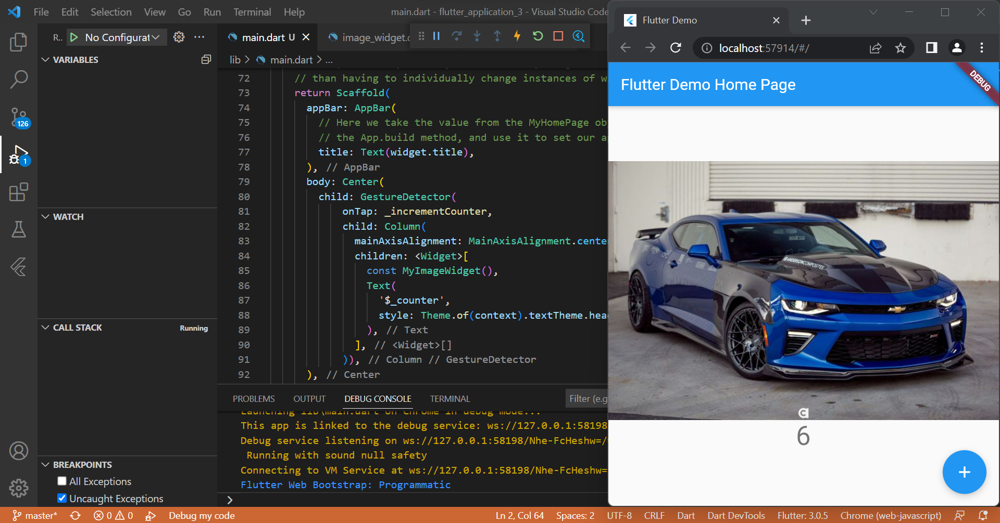
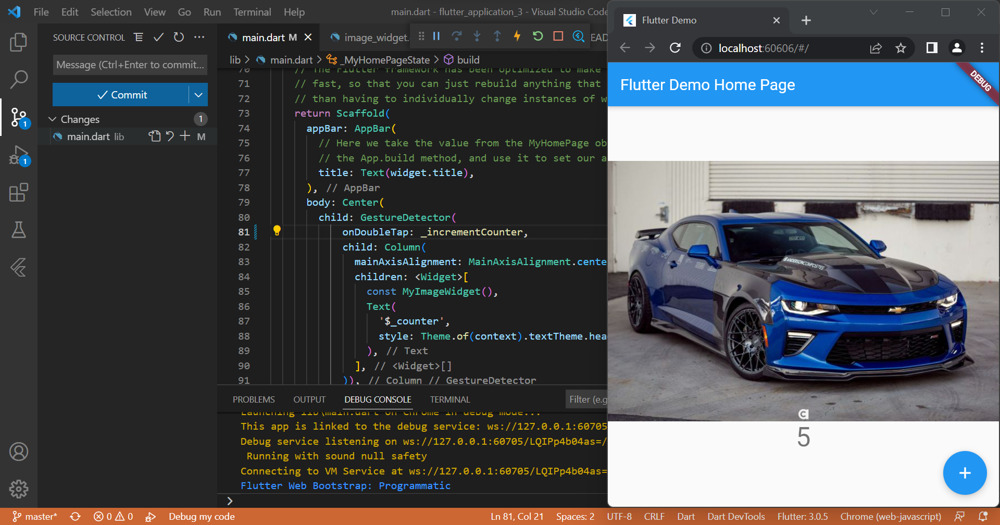

# Laporan Praktikum

## Gesture Detector

1. onTap

Gambar diatas adalah hasil *running project* flutter_application_3. Dapat dilihat, apabila gambar di klik sekali, maka angka yang ada dibawahnya akan bertambah. Ini disebabkan karena perintah **onTap: _incrementCounter** yang disematkan pada kode.

2. onDoubleTap

Gambar diatas adalah hasil *running project* flutter_application_3. Dapat dilihat, apabila gambar di klik dua kali, maka angka yang ada dibawahnya akan bertambah. Ini disebabkan karena perintah **onDoubleTap: _incrementCounter** yang disematkan pada kode.

3. onLongPress

Gambar diatas adalah hasil *running project* flutter_application_3. Dapat dilihat, apabila gambar di tekan lama, maka angka yang ada dibawahnya akan bertambah. Ini disebabkan karena perintah **onLongPress: _incrementCounter** yang disematkan pada kode.